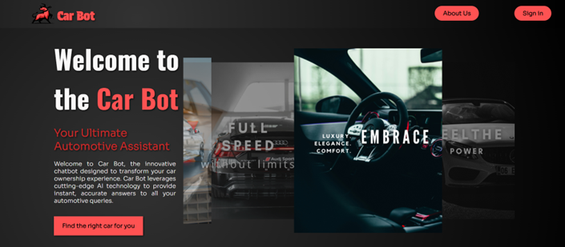

# CAR BOT ASSISTANT - STUDENT PROJECT 

# 🚗 Car Bot Assistant - Student Project

**CarBot** is a web application designed to simplify the process of researching and finding information about cars. It provides users with an intuitive chat-based interaction through a virtual assistant, **Car Bot**, powered by **Wit.ai**.

---

## 🎯 Problem Statement
Many users need **quick, accurate, and detailed** car search results, including prices, specifications, and images, without visiting multiple websites. **CarBot** aggregates this information in one place, allowing users to interact through **text and voice commands**.


---

## 🛠️ Technology Stack

This project is built using the **MERN stack** (**MongoDB, Express.js, React.js, Node.js**) with additional integrations.

### **1️⃣ Frontend - React.js**
- **React.js** is a JavaScript library for building dynamic, interactive UIs.
- It is used in this project to:
  - Render the **chat interface** dynamically.
  - Fetch and display **car-related data** from the backend.
  - Handle **user interactions** with chatbot messages.
  - Maintain **state management** using **React Hooks**.

### **2️⃣ Backend - Node.js & Express.js**
- **Node.js** is a JavaScript runtime that allows running JavaScript on the **server-side**.
- **Express.js** is a **minimal and flexible** web framework for building APIs.
- Key backend functionalities:
  - Handles **API requests** from the frontend.
  - Sends **user queries** to Wit.ai for processing.
  - Retrieves and stores data in **MongoDB**.
  - Implements **authentication and authorization** using **JWT (JSON Web Tokens).**

### **3️⃣ Database - MongoDB**
- **MongoDB** is a **NoSQL** database used for:
  - Storing **car information** (brand, model, price, specifications).
  - Managing **chatbot conversation history**.
  - Storing structured data imported from a **CSV dataset**.
  - Handling **large-scale unstructured data efficiently**.

### **4️⃣ Chatbot & NLP - Wit.ai**
- **Wit.ai** is an **AI-powered NLP (Natural Language Processing) platform**.
- It helps **CarBot**:
  - Understand **user intent** (e.g., "Find me a car under $20,000").
  - Extract **entities** such as brand names, price ranges, and car models.
  - Respond to queries dynamically with relevant **car data**.

### **5️⃣ Real-time Communication - WebSockets**
- **Socket.io** is used for real-time **bidirectional communication**.
- It enables **instant chatbot responses** without refreshing the page.
- Maintains an **active connection** between the frontend and backend.

### **6️⃣ Image Retrieval - Unsplash API**
- The **Unsplash API** dynamically fetches **high-quality images** of cars.
- Used to provide **visual representation** of search results.

### **7️⃣ Stock Market Data - Finhub API**
- The **Finhub API** provides **real-time stock prices** for **car brands**.
- Helps users **track market trends** of car manufacturers.

---

## 📊 Application Architecture

Below is the **conceptual diagram** showing how different components interact:


### **🏗️ How the System Works**
1. **User Interaction:** Users communicate with **Car Bot** via text or voice.
2. **Backend Processing:** Express.js processes user queries.
3. **Natural Language Understanding (NLU):** Queries are sent to **Wit.ai** for intent recognition.
4. **Database Retrieval:** Car details are fetched from **MongoDB** or **CSV dataset**.
5. **API Communication:** The system fetches car images (**Unsplash API**) and stock data (**Finhub API**).
6. **Real-time Responses:** Chatbot dynamically **responds** using **WebSockets**.

This ensures **structured, real-time responses** to user queries.


---

## 🏁 Installation & Setup

### 🚀 Step 1: Clone the Repository

```bash
git clone https://github.com/Rale01/CarBot-AI-Assistant.git
```

### 📦 Step 2: Install Dependencies
```bash
npm install
```

### 🔥 Step 3: Start the Server
```bash
cd projekat
cd server
npm start
```

### 🌍 Step 4: Start the Frontend
```bash
cd projekat
cd server
npm start
```

### 🛠️ Step 5: Open the Application in Your Browser
Once both frontend and backend are running, open your browser and start chatting with Car Bot! 🚀

---

## 🏆 Features

✔️ Search for cars by brand, model, and price
✔️ Retrieve car specifications from a structured CSV dataset
✔️ Chatbot with Natural Language Processing (Wit.ai)
✔️ Fetch real-time car images from Unsplash API
✔️ Track stock market trends of car brands (Finhub API)
✔️ Real-time chatbot responses via WebSockets





